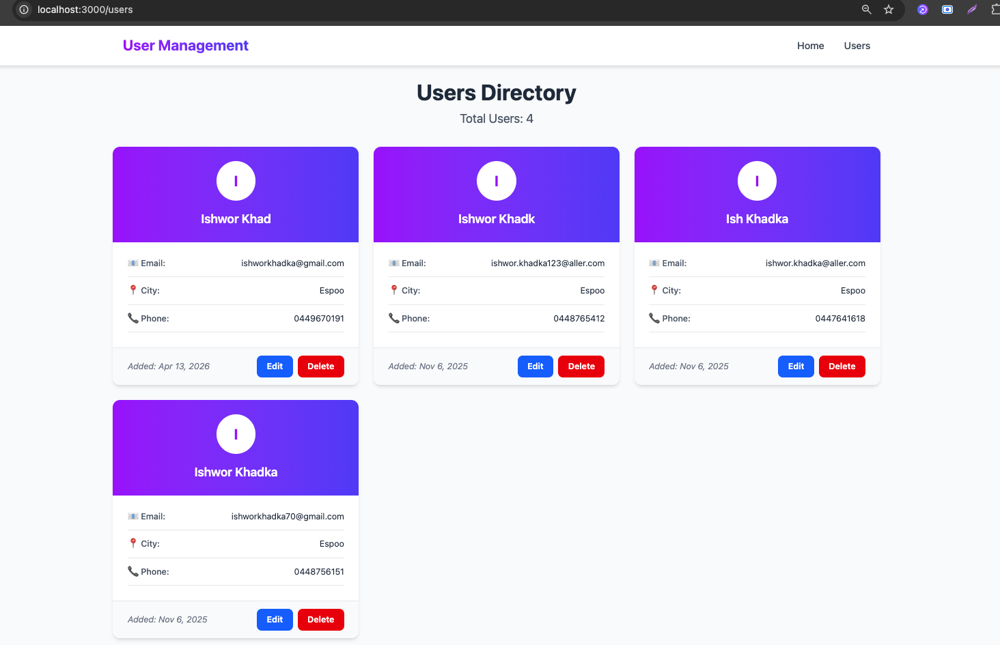

# React 19 + MySQL User Management System

A modern full-stack CRUD application showcasing **React 19's latest features** including `useActionState` and the `use()` API, built with Express.js backend and MySQL database.

## Project Overview

This project demonstrates a complete user management system with **full CRUD operations** (Create, Read, Update, Delete). It emphasizes modern React 19 patterns and best practices for data fetching and form handling using `useActionState` and the `use()` API.

## Screenshots

### Home Page - User Creation Form

*Create new users with `useActionState` for form handling*

### Users Directory

*View all users fetched with React 19's `use()` API and Suspense*

## Key Features

### React 19 Modern APIs

#### `use()` API for Data Fetching
- **Suspense-based data fetching** - Declarative loading states
- **Promise unwrapping** - Clean async data handling without useEffect
- **Built-in caching** - Using React's `cache()` function for optimized performance
- **No manual loading states** - Suspense handles it automatically

```tsx
const UsersList = ({ usersList }: { usersList: Promise<User[]> }) => {
  const users = use(usersList); // Unwrap the promise!
  // Component suspends until data is ready
  return <div>{users.map(...)}</div>;
};
```

#### `useActionState` for Form Submissions
- **Progressive enhancement** - Forms work without JavaScript
- **Built-in pending states** - No manual loading state management
- **Automatic form handling** - Native FormData API integration
- **Server actions pattern** - Clean separation of concerns
- **Used for both Create and Update operations** - Consistent pattern across mutations

**Creating Users:**
```tsx
const [state, formAction, isPending] = useActionState(createUserAction, initialState);

<form action={formAction}>
  <input name="email" />
  <button disabled={isPending}>
    {isPending ? 'Creating...' : 'Create User'}
  </button>
</form>
```

**Updating Users:**
```tsx
const [state, formAction, isPending] = useActionState(updateUserAction, initialState);

<form action={formAction}>
  <input type="hidden" name="userId" value={user.id} />
  <input name="name" defaultValue={user.name} />
  <button disabled={isPending}>
    {isPending ? 'Updating...' : 'Update User'}
  </button>
</form>
```

### Technical Stack

**Frontend:**
- React 19.1.1 with TypeScript
- Vite 7.1.7 (Build tool)
- React Router DOM 7.9.5 (Routing)
- Tailwind CSS v4.1.16 (Styling)

**Backend:**
- Node.js with Express.js 4.18.2
- MySQL 2 (mysql2 package)
- RESTful API architecture
- CORS enabled


## Getting Started

### Installation

1. **Clone the repository**
```bash
git clone <repository-url>
cd REACTMYSQL
```

2. **Setup Backend**
```bash
cd backend
npm install
```

3. **Configure Database**
   - Create a MySQL database named `test`
   - Update `.env` file with your credentials:
```env
DB_HOST=localhost
DB_USER=root
DB_PASSWORD=
DB_NAME=test
DB_PORT=3306
```

4. **Initialize Database**
   - SQL query used to create the `test_users` table:
```sql
CREATE TABLE IF NOT EXISTS test_users (
  id INT AUTO_INCREMENT PRIMARY KEY,
  name VARCHAR(100) NOT NULL,
  email VARCHAR(100) NOT NULL UNIQUE,
  city VARCHAR(100),
  phone_number VARCHAR(20),
  created_at TIMESTAMP DEFAULT CURRENT_TIMESTAMP,
  updated_at TIMESTAMP DEFAULT CURRENT_TIMESTAMP ON UPDATE CURRENT_TIMESTAMP
);
```

5. **Setup Frontend**
```bash
cd ../frontend
npm install
```

### Running the Application

1. **Start Backend Server** (Terminal 1)
```bash
cd backend
node server.js
# Server runs on http://localhost:5000
```

2. **Start Frontend Dev Server** (Terminal 2)
```bash
cd frontend
npm run dev
# App runs on http://localhost:3000
```

3. **Open Browser**
```
http://localhost:3000
```

## 🎨 API Endpoints

| Method | Endpoint | Description |
|--------|----------|-------------|
| GET | `/api/test` | Health check |
| GET | `/api/users` | Get all users |
| POST | `/api/users` | Create new user |
| PUT | `/api/users/:id` | Update user by ID |
| DELETE | `/api/users/:id` | Delete user by ID |

## Key Concepts

### Caching Strategy
- Uses React's built-in `cache()` function
- Ensures stable Promise references for `use()` API
- Prevents infinite suspension loops
- Automatic deduplication

### Suspense Integration
- Declarative loading states
- Cleaner component tree

### TypeScript Integration
- Full type safety across frontend

## Learn More

- [React 19 Documentation](https://react.dev/)
- [use() API Reference](https://react.dev/reference/react/use)
- [useActionState Hook](https://react.dev/reference/react/useActionState)
- [Suspense for Data Fetching](https://react.dev/reference/react/Suspense)

**Built with using React 19's latest features**
